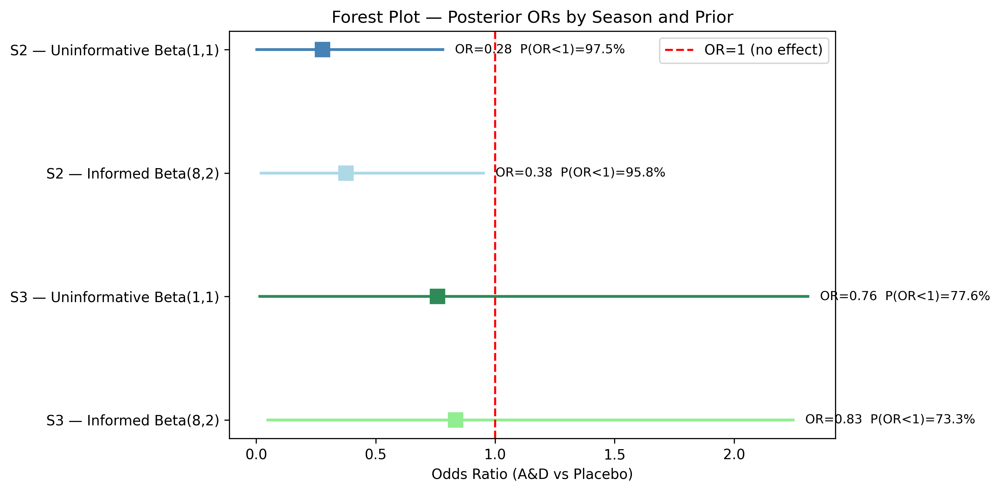

# Bayesian Analysis of Vitamin A&D Supplementation on Influenza Vaccine Response

**A portfolio project demonstrating Bayesian statistical modelling applied to a small-sample paediatric RCT**

---

## The Question

Does Vitamin A&D supplementation improve influenza vaccine response (seroconversion) in children aged 8–11?

This portfolio uses data from [NCT02649192](https://clinicaltrials.gov/study/NCT02649192) — a randomised, blinded, placebo-controlled RCT conducted across three consecutive flu seasons (2015–2018). Children received either vitamin A and D supplementation or placebo, with H1N1 seroconversion measured at Day 56 as the primary outcome. This analysis focuses on seasons S2 (2016–2017) and S3 (2017–2018), with 11–21 participants per group.

---

## Why This Dataset

The frequentist analysis returned **p > 0.30 for both seasons** — conventionally dismissed as "not significant." But with only 11–21 patients per group, a null p-value does not mean no effect. This is exactly the scenario where Bayesian analysis adds value: quantifying *how much evidence exists*, rather than returning a binary significant/not-significant verdict.

Prior evidence supports the biological plausibility of the intervention: vitamin A supplementation improves vaccine seroconversion by 13–35% in children across multiple vaccine types, including live and inactivated vaccines ([Healthcare Bulletin, 2023](https://www.healthcare-bulletin.co.uk/article/nutritional-strategies-to-enhance-vaccine-efficacy-in-infants-and-young-children-3919/); [Fisker et al., PMC12334918](https://pmc.ncbi.nlm.nih.gov/articles/PMC12334918/)). A relevant RCT in 1,077 Ghanaian infants found that vitamin A supplementation significantly improved hepatitis B seroprotection (93.9% vs 90.2%, P=0.04; Sam et al., *J Nutr*, 2007, [PMID:17449592](https://pubmed.ncbi.nlm.nih.gov/17449592/)) — a rate which, if anything, makes Beta(8,2) (mean ~80%) a conservative informed prior. These findings informed the choice of an informed prior (Beta(8,2)) for sensitivity analysis.

Surprisingly, the observed data showed the opposite direction to the prior evidence: the A&D group had *lower* overall seroconversion in both seasons (71.4% vs 95.0% in S2; 72.7% vs 85.7% in S3). This is not a model error. Patel et al. (2019, [PMC6832482](https://pmc.ncbi.nlm.nih.gov/articles/PMC6832482/)) provides the explanation: **the effect of A&D depends critically on baseline vitamin status** — supplementation improved responses in vitamin-insufficient children (p < 0.001) but weakened responses in vitamin-replete children (p = 0.02). The children in this dataset appear to be largely vitamin-replete, placing them in the latter category. The unstratified Bayesian model below captures this net attenuating effect and motivates the natural next step: a model stratified by baseline vitamin A/D status, which Patel et al. identify as the key effect modifier.

---

## Results with Bayesian analysis

| Season | Frequentist                  | Bayesian P(OR < 1 \| data)                                                     |
| ------ | ---------------------------- | ------------------------------------------------------------------------------ |
| S2     | p > 0.30 — "not significant" | **97.6%** probability A&D group had lower seroconversion than placebo (OR < 1) |
| S3     | p > 0.30 — "not significant" | **77.7%** probability A&D group had lower seroconversion than placebo (OR < 1) |

Results are **robust to prior choice**: prior sensitivity analysis (Beta(1,1) vs Beta(8,2)) showed < 5 percentage point difference for both seasons.



> *"The frequentist analysis returned p > 0.30 — 'not significant.' The Bayesian model tells a more complete story: in both seasons, the A&D group had lower overall seroconversion than placebo (71.4% vs 95.0% in S2; 72.7% vs 85.7% in S3), with posterior P(OR < 1) of 97.6% and 77.7%, respectively — robust to prior choice. This is consistent with Patel et al.'s finding that in vitamin-replete children, A&D supplementation does not improve and may attenuate vaccine response. The wide credible intervals reflect genuine uncertainty from small samples (n=11–21 per group). The unstratified model is a deliberate simplification: the natural next step is a Bayesian model stratified by baseline vitamin A/D status — which the published data identifies as the key effect modifier."*

---

## Biological Interpretation & Limitations

**Why OR < 1 in a vitamin-replete population:** Patel et al. ([PMC6832482](https://pmc.ncbi.nlm.nih.gov/articles/PMC6832482/)) proposed a plausible mechanism — vitamin D upregulates cathelicidin, an anti-microbial peptide that may rapidly clear influenza vaccine antigens before triggering an antibody response, attenuating immunogenicity in children who are already vitamin-replete.

**Unmeasured confounders:** The published dataset did not capture T cell, B cell, or antigen-presenting cell (APC) phenotypes — all of which mediate B cell activation and antibody production and are directly sensitive to vitamin levels. Additional sources of variation include differences in baseline HAI responses across individual vaccine components and potential subclinical influenza exposures during the study period.

**Conclusion:** These limitations, together with small group sizes (n = 11–21), reinforce the primary finding: the unstratified model captures the net effect in a largely vitamin-replete sample. A larger study measuring baseline vitamin A/D status would allow stratified analysis — isolating the effect of supplementation separately in deficient and replete subgroups, where the biology is expected to diverge.

Stratifying the existing data by baseline vitamin status would reduce already small groups (n = 11–21) to subgroups of approximately 5–10 participants — too few to draw meaningful conclusions from any model. This is not a criticism of the original trial design: NCT02649192 was conducted between 2015 and 2018, and Patel et al.'s findings were published in 2019, after the trial was completed. The original investigators could not have anticipated this effect modifier. Patel et al.'s work now provides the key insight for future studies: baseline vitamin A and D levels should be measured at enrolment and incorporated into the power calculation from the outset, with sample sizes sufficient to detect subgroup effects in deficient and replete populations separately.

---

## Project Structure

```
Portfolio/
├── notebooks/
│   ├── 01_data_simulation.py        # Simulate patient-level data from published summary statistics
│   ├── 02_exploratory_analysis.py   # Wilson CIs, Fisher's exact test, frequentist forest plot
│   └── 03_bayesian_model.py         # Beta-Binomial model, prior sensitivity, posterior plots
├── figures/
│   ├── 02_seroconversion_with_ci.png     # Seroconversion rates with 95% Wilson CIs
│   ├── 02_forest_plot_observed.png       # Frequentist forest plot (OR + CIs)
│   ├── 03_bayesian_model.png             # Posterior distributions by season and treatment
│   └── 03_bayesian_model_forest_plot.png # Bayesian forest plot with prior comparison
├── data/
│   └── simulated_patient_data.csv
└── requirements.txt
```

---

## Methods

- **Data simulation** based on published summary statistics (season × treatment group counts)
- **Exploratory analysis**: Wilson confidence intervals, Fisher's exact test, frequentist odds ratios
- **Bayesian model**: Beta-Binomial model in PyMC
  - Prior 1: Beta(1,1) — uninformative (no prior assumption on seroconversion rate)
  - Prior 2: Beta(8,2) — informed (encodes a prior belief of ~80% baseline seroconversion, used to test sensitivity to prior choice)
  - Derived quantity: Odds Ratio per season via `pm.Deterministic`
  - Sampling: NUTS sampler, 2000 draws, convergence verified (r̂ = 1.00, ESS > 7000)
- **Key output**: P(OR < 1 | data) — posterior probability that A&D reduces seroconversion
- **Next step**: Hierarchical Bayesian model to partially pool seasons while accounting for biological heterogeneity

---

## How to Run

```bash
# Create virtual environment
python -m venv venv
source venv/bin/activate

# Install dependencies
pip install -r requirements.txt

# Run in order
cd notebooks/
python 01_data_simulation.py
python 02_exploratory_analysis.py
python 03_bayesian_model.py
```

---

## Requirements

```
pandas
numpy
matplotlib
scipy
arviz
pymc
```

---

## Author

**Lara Francesca Scofano, PhD**
[LinkedIn](https://www.linkedin.com/in/larafscofano)

*Built as part of an independent project. 
Developed using Python, PyMC, ArviZ, and Claude Anthropic.*

---
